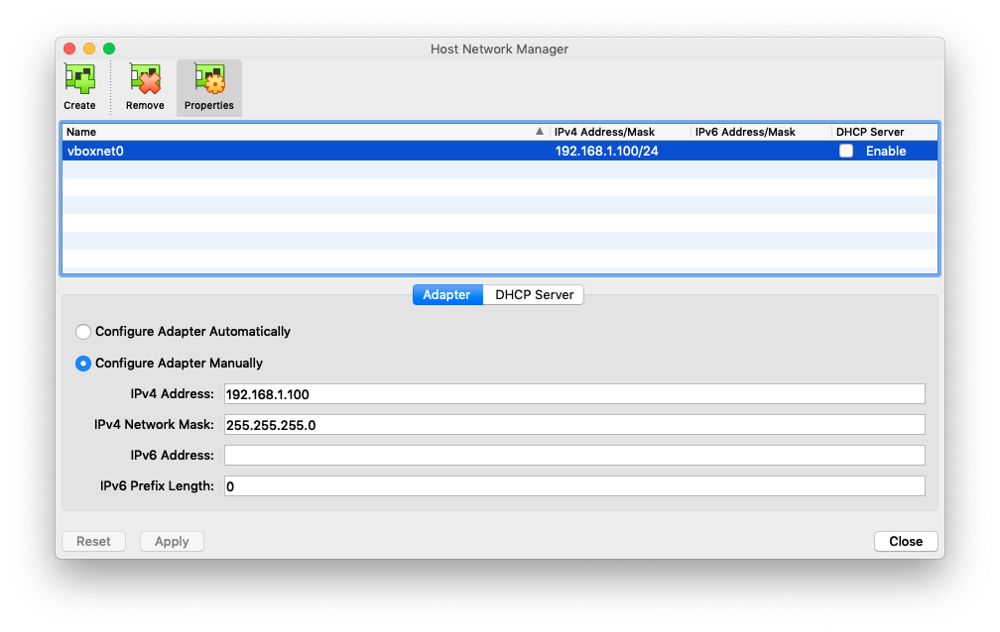
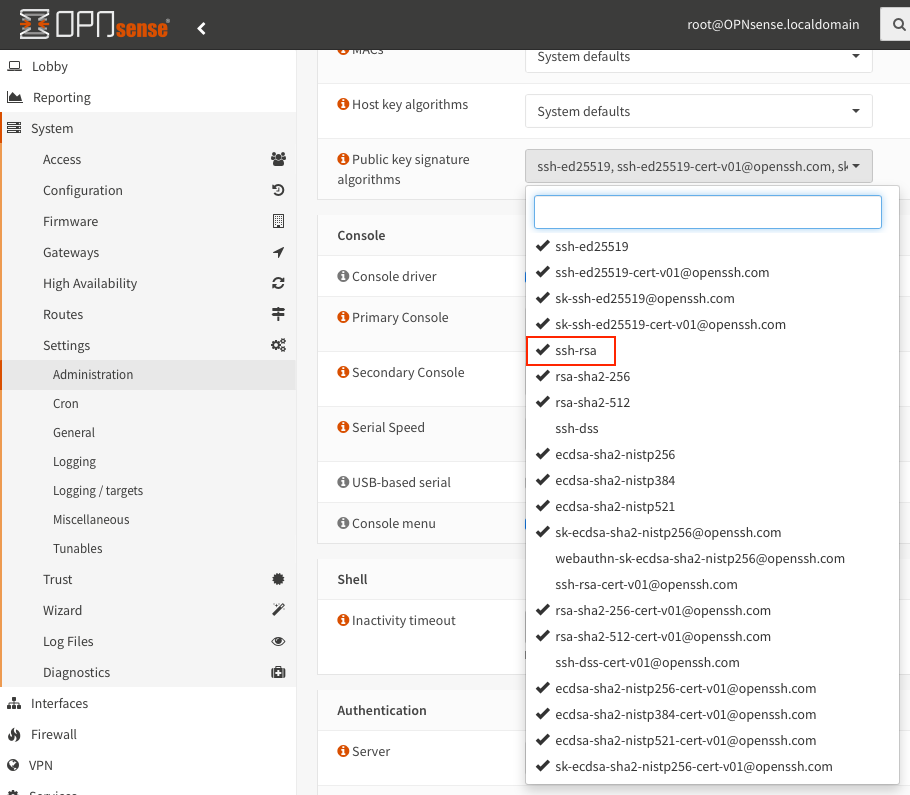

Bootstrap an OPNsense development environment in Vagrant
========================================================

Requirements
------------

* A system capable of running VirtualBox
* [Vagrant](https://www.vagrantup.com)
* [VirtualBox](https://www.virtualbox.org)

Preparation
-----------

Create a host-only network in VirtualBox with an IP address in `192.168.1.0/24`
but **not** `192.168.1.1`. This is the address your OPNsense will use for the LAN
interface by default. Make sure DHCP is disabled on that interface.


Selecting the OPNsense version
------------------------------

You can set the variable `$opnsense_release` to the desired OPNsense release e.g. `22.7` in [Vagrantfile](Vagrantfile)
to select the matching major release version. Likewise you can set `$opnsense_box` to the base box version
to bootstrap from. For `22.7` that is `punktde/freebsd-131-ufs`.

Provision the VM
----------------

```sh
git clone git@github.com:punktDe/vagrant-opnsense.git
cd vagrant-opnsense
vi Vagrantfile # adjust OPNsense version if desired
vagrant up
```

This will automatically

1. download a plain FreeBSD Vagrant box provided by [punkt.de infrastructure](https://infrastructure.punkt.de/).
2. boot the VM.
3. convert the VM into an OPNsense installation with the [bootstrap](https://github.com/opnsense/update/) method.
4. adjust the configuration for this development environment - SSH will be enabled and permitted on all interfaces!
5. reboot the resulting VM.

Should you need to repeat this step from the start you can always

```sh
vagrant destroy
vagrant up
```

**If `vagrant up` cannot connect via SSH initially, you need to apply the workaround below.**

Connect via your browser
------------------------


Use the default user and password of `root/opnsense`.

Congratulations! You have a working OPNsense installation in Vagrant/Virtualbox.
Now navigate through the initial setup wizard or skip it as instructed in the UI.

Connect via SSH
---------------

Use `vagrant ssh` to login. `sudo` will work without password.

Additional steps
----------------

* You should install the `os-virtualbox` plugin so you can cleanly shutdown and startup the system.
* Also disable the DHCP server on LAN.

Work around Vagrant's broken SSH public key algorithm detection
---------------------------------------------------------------

Vagrant uses a bundled Ruby based implementation for initial SSH connection to set up IP adresses,
NFS mounts, etc. `vagrant ssh` on the contrary uses a plain command line SSH client.

Unfortunately the Ruby library bogusly identifies RSA 256 and higher public key exchange algorithms
as RSA 1 and then tries to log in with that. Which OpenSSHd in OPNsense refuses in the default configuration.

So you need to adjust the supported algorithms in the UI for `vagrant up` to fully work.

Find out which algorithms are supported and considered secure:

```sh
vagrant ssh
sudo sshd -T | awk '/pubkeyacceptedalgorithms/ { print $2 }' | tr ',' '\n'
```

Explicitly list the algorithms in the advanced section of the UI but add **ssh-rsa**:


Routing traffic through the firewall
------------------------------------

The firewall you just created is completely functional so you can route individual networks or
addresses through it on your desktop system. E.g. to access my company's web page through OPNsense
you can route our entire address range appropriately.

On a Mac:

```sh
sudo route add -net 217.29.32.0/20 192.168.1.1
```

On Windows:

```cmd
route ADD 217.29.32.0 MASK 255.240.0.0 192.168.1.1
```

Now when you lookup [our website](https://infrastructure.punkt.de/) in your browser the traffic
will go through the OPNsense running in VirtualBox/Vagrant. Make sure to disable IPv6 on your Mac
for these experiments if you have a native IPv6 connection. If you don't the browser will prefer that.

Changing the LAN IP address
---------------------------

If you want to change the LAN network after initial deployment, e.g. because you use
`192.168.1.0/24` already, use these steps:

1. Change the IP address in the UI, save and apply. Use anything **but** the lowest address (.1)
   Keep a `/24` netmask. You will lose connectivity, of course.
2. Use `vagrant halt` to shutdown the VM. Vagrant connects via WAN, so this still works.
3. Edit `Vagrantfile` and change `$virtual_machine_ip` to your new value.
4. Start the VM with `vagrant up`. Vagrant will automatically create a matching host-only network
   and use the lowest address (.1) for your development system.
5. Use the new address to connect via browser once the VM is up and running.

Starting development
--------------------

```sh
vagrant ssh
sudo su -
opnsense-code -d /var/vagrant core    # first time will clone tools repo
opnsense-code -d /var/vagrant core    # this will clone the OPNsense core repo proper
opnsense-code -d /var/vagrant plugins # clone plugins repo for good measure
```

---
Enjoy!
