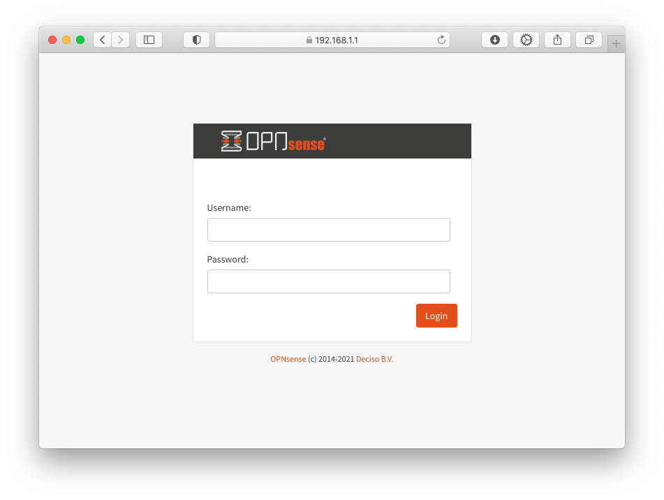

Bootstrap an OPNsense development environment in Vagrant
========================================================

Requirements
------------

* A system capable of running VirtualBox
* [Vagrant](https://www.vagrantup.com) >= 2.3.4
* [VirtualBox](https://www.virtualbox.org) >= 7.0.4

Networking considerations
-------------------------

VirtualBox reserves the `192.168.56.0/21` range of IPv4 addresses for host-only networking.
The default address of your OPNsense firewall in this project is `192.168.56.56`. If that collides
with your local infrastructure set a different one in the [Vagrantfile](Vagrantfile). Make sure
not to pick the lowest one in the respective network, which is reserved for the host by VirtualBox.

For more details see the relevant [VirtualBox documentation](https://www.virtualbox.org/manual/ch06.html#network_hostonly).

Selecting the OPNsense version
------------------------------

You can set the variable `$opnsense_release` to the desired OPNsense release e.g. `23.7` in [Vagrantfile](Vagrantfile)
to select the matching major release version. Likewise you can set `$opnsense_box` to the base box version
to bootstrap from. For `23.7` that is `punktde/freebsd-132-ufs`.

Provision the VM
----------------

```sh
git clone git@github.com:punktDe/vagrant-opnsense.git
cd vagrant-opnsense
vi Vagrantfile # adjust OPNsense version if desired
vagrant up
```

This will automatically

1. download a plain FreeBSD Vagrant box provided by [punkt.de infrastructure](https://infrastructure.punkt.de/).
2. boot the VM.
3. convert the VM into an OPNsense installation with the [bootstrap](https://github.com/opnsense/update/) method.
4. adjust the configuration for this development environment - SSH will be enabled and permitted on all interfaces!
5. reboot the resulting VM.

Should you need to repeat this step from the start you can always

```sh
vagrant destroy
vagrant up
```

Connect via your browser
------------------------



Use the default user and password of `root/opnsense`.

Congratulations! You have a working OPNsense installation in Vagrant/Virtualbox.
Now navigate through the initial setup wizard or skip it as instructed in the UI.

Connect via SSH
---------------

Use `vagrant ssh` to login. `sudo` will work without password.

Additional steps
----------------

* You should install the `os-virtualbox` plugin so you can cleanly shutdown and startup the system.
* Also disable the DHCP server on LAN.

Routing traffic through the firewall
------------------------------------

The firewall you just created is completely functional so you can route individual networks or
addresses through it on your desktop system. E.g. to access my company's web page through OPNsense
you can route our entire address range appropriately.

On a Mac:

```sh
sudo route add -net 217.29.32.0/20 192.168.56.56
```

On Windows:

```cmd
route ADD 217.29.32.0 MASK 255.240.0.0 192.168.56.56
```

Now when you lookup [our website](https://infrastructure.punkt.de/) in your browser the traffic
will go through the OPNsense running in VirtualBox/Vagrant. Make sure to disable IPv6 on your Mac
for these experiments if you have a native IPv6 connection. If you don't the browser will prefer IPv6 over IPv4.

Changing the LAN IP address
---------------------------

If you want to change the LAN network after initial deployment use these steps:

1. Change the IP address in the UI, save and apply. Use anything **but** the lowest address (.1).
   Keep a `/24` netmask. You will lose connectivity, of course.
2. Use `vagrant halt` to shutdown the VM. Vagrant connects via WAN, so this still works.
3. Edit `Vagrantfile` and change `$virtual_machine_ip` to your new value.
4. Start the VM with `vagrant up`. Vagrant will automatically create a matching host-only network
   and use the lowest address (.1) for your development system.
5. Use the new address to connect via browser once the VM is up and running.

Starting development
--------------------

Please refer to the [OPNsense tools documentation](https://github.com/opnsense/tools)
for details on how to set up a build system. To clone the build environment into the
`/var/vagrant` directory (mounted from your host system) from within the box use e.g.:

```sh
# log in to box, become root - press [8] to invoke a shell from the OPNsense menu
vagrant ssh
sudo su -

# install git and configure NFS mounted directories as safe
pkg install git
git config --global --add safe.directory /var/vagrant/core
git config --global --add safe.directory /var/vagrant/plugins
git config --global --add safe.directory /var/vagrant/ports
git config --global --add safe.directory /var/vagrant/src
git config --global --add safe.directory /var/vagrant/tools

# clone the OPNsense repositories - this will take some time
cd /var/vagrant
git clone https://github.com/opnsense/tools
cd tools
env ROOTDIR=/var/vagrant make update
```

The `.gitignore` file of this project is already configured to ignore the OPNsense
source code. Edits and individual `git` operations can now be done on your host system.

---
Enjoy!
